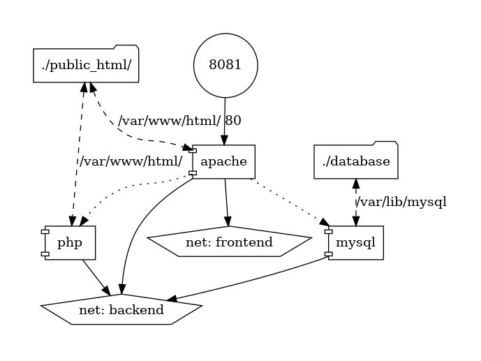

# cloudlab-6
Lab 6 of cloud lab.

The created project serves as a LAMP service.

This service consists of three component services:
- Apache server (httpd:2.4.35-alpine),
- PHP server (php:7.3-rc-fpm-alpine),
- MySQL server (mysql:5.7.36).

Use a command to start the service:

`docker-compose up`

Files are hosted from "./public_html" folder where index.php with MySQL connection test is already created.

Generated graphic representation:

Apache configuration file which extends default configuration is in folder "./_services/apache/".